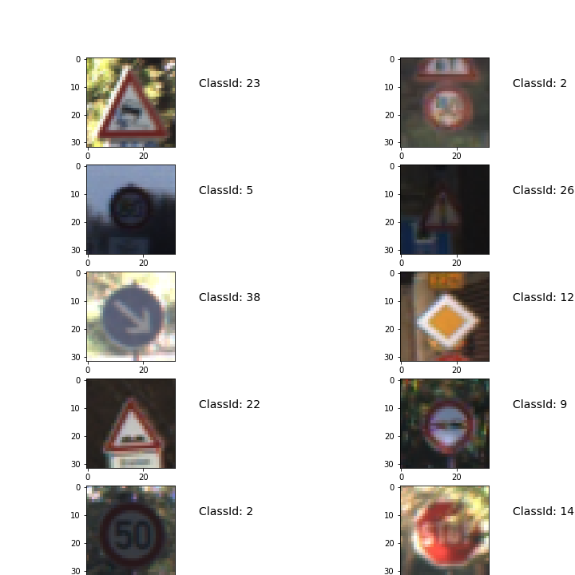
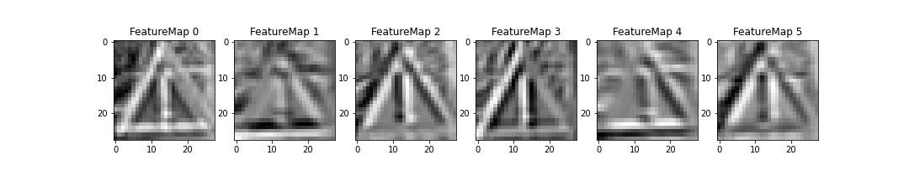

# **Traffic Sign Recognition** 

This is one summarize of the projcet **Traffic Sign Recognition**. The goals / steps of this project are the following:
* Load the data set (see below for links to the project data set)
* Explore, summarize and visualize the data set
* Design, train and test a model architecture
* Use the model to make predictions on new images
* Analyze the softmax probabilities of the new images

[//]: # (Image References)

[image1]: ./examples/visualization.jpg "Visualization"
[image2]: ./examples/grayscale.jpg "Grayscaling"
[image3]: ./examples/random_noise.jpg "Random Noise"
[image4]: ./examples/placeholder.png "Traffic Sign 1"
[image5]: ./examples/placeholder.png "Traffic Sign 2"
[image6]: ./examples/placeholder.png "Traffic Sign 3"
[image7]: ./examples/placeholder.png "Traffic Sign 4"
[image8]: ./examples/placeholder.png "Traffic Sign 5"

Here I will consider the [rubric points](https://review.udacity.com/#!/rubrics/481/view) individually and describe how I addressed each point in my implementation.  

## Data Set Summary & Exploration

### Dataset Summary

The data is loaded in the step 0 and the code could be found in the cell of **Step 0** in the jupyter file *Traffic_Sign_Classifier.ipynb*. All data is in the folder *../data*. The training, validation and testing data are correspondingly saved in the file *train.p*, *valid.p* and *test.p*.

The python funciton len() and the numpy library are used to calculate summary statistics of the traffic
signs data set:
* The size of training set is 34799
* The size of the validation set is 4410
* The size of test set is 12630
* The shape of a traffic sign image is (32, 32, 3)
* The number of unique classes/labels in the data set is 43

### Exploratory Visualization
Ten traffic sign images are selected randomly from the training dataset and shown as following:

One bar chart showing how many images for each sign is generated as following:

## Design and Test a Model Architecture

### Preprocessing

As a first step, I decided to convert the images to grayscale because we can get most of information from the grayscale image, that should be enough for us to indentify the traffic sign, and that also can reduce the computing time.

Here is some examples of a traffic sign image before and after grayscaling.

As a last step, I normalized the image data to get reduce the errors using the quick way (pixel - 128)/ 128.

### Model architecture

 Describe what your final model architecture looks like including model type, layers, layer sizes, connectivity, etc.) Consider including a diagram and/or table describing the final model.

My final model consisted of the following layers:

| Layer         		|     Description	        					| 
|:---------------------:|:---------------------------------------------:| 
| Input         		| 32x32x1 Gray image   							| 
| Convolution 5x5     	| 1x1 stride, valid padding, outputs 28x28x6 	|
| RELU					|												|
| Max pooling	      	| 2x2 stride,  outputs 14x14x6  				|
| Convolution 5x5	    | 1x1 stride, valid padding, outputs 10x10x16   |
| RELU					|												|
| Max pooling	      	| 2x2 stride,  outputs 5x5x16  		    		|
| Flatten   	      	| outputs 400                 		    		|
| Fully connected		| outputs 200  									|
| RELU					|												|
| Fully connected		| outputs 120  									|
| RELU					|												|
| Dropout				| keep rate 0.5									|
| Fully connected		| outputs 43  									|
|						|												|
|						|												|
 

### Model Training

To train the model, I used the Adam algorithm: *tf.train.AdamOptimizer()*. For some parameters as following:

| Parameter         	|     Value	   			| 
|:---------------------:|:---------------------:| 
| Epochs         		|     20        		| 
| Batch size        	|     128           	|
| Learning rate			|	0.002				|
|						|						|

### Solution Approach

My final model results were:
* validation set accuracy of 0.94 
* test set accuracy of 0.93

The LeNet architecture has a good profermence in the recognition of letters as shown in the lecture, so I want to try to use it as the model. At the begining, I use the input as one color image, which means using the data in 32x32x3. However, I cannot get one good performance even I try to adjust the learning rate, batch size and epoch number. I have tried to use the average pooling instead of the maximum pooling, there isn't a improvement.

Then, I try to connect the output of the first layer with the fully connected layer as shown in the paper [Traffic Sign Recognition with Multi-Scale Convolutional Networks](http://yann.lecun.com/exdb/publis/pdf/sermanet-ijcnn-11.pdf), but still failed.

Thirdly, I begin to use the gray image(32x32x1) as input. There is little improvement, but not satisfied. Finally, I recall that maybe it it the overfitting problem. SO I add one dropout step which give one better performance. By adjusting the keep rate, I get the accuracy as shown at begining.
 
## Test a Model on New Images

### Acquiring New Images

Here are six German traffic signs that I found on the web:

 

At the begining, I load the original image directly which are in different size and not 32x32. After I load them, I try to resize the image by function **transform.resize(ppm_img, (32, 32))** and then try to recognize them. However, it always failed. 

Then, according other people's experience, I cut those image in the size where the width equal to the height. Then convert the *ppm* image to *png* image. Lastly, resizing the image to 32x32 by some online tool. In this way, I get those images as following:
 

### Performance on New Images

Here are the results of the prediction:

| Image			        |     Prediction	        					| 
|:---------------------:|:---------------------------------------------:| 
| Vehicles over 3.5 metric tons prohibited| Vehicles over 3.5 metric tons prohibited | 
| Speed limit (80km/h) 	| Speed limit (30km/h) 	        				|
| Yield					| Yield											|
| Keep right	      	| Keep right					 				|
| General caution		| General caution      							|
| Stop		        	| Stop      		        					|
|   		        	|             		        					|
|   		        	|             		        					|

The model was able to correctly guess 5 of the 6 traffic signs, which gives an accuracy of 83.3%. One error is the second image, Speed limit (80km/h), predicted as Speed limit (30km/h). The number 8 and number 3 is closed in some situation. 

### Model Certainty - Softmax Probabilities

 3. Describe how certain the model is when predicting on each of the five new images by looking at the softmax probabilities for each prediction. Provide the top 5 softmax probabilities for each image along with the sign type of each probability. (OPTIONAL: as described in the "Stand Out Suggestions" part of the rubric, visualizations can also be provided such as bar charts)

For the first image, as the prediction of model, it a sign for *Vehicles over 3.5 metric tons prohibited* (probability of 0.93), and the image does contain a stop sign. The top five soft max probabilities were shown in one bar chart: 

 

For the second image, as the prediction of model, it a sign of *Speed limit (30km/h)* (probability of 1.0), however the image is a sign of *Speed limit (80km/h)*. The top five soft max probabilities were shown in one bar chart: 

 

For the third image, as the prediction of model, it a Yield sign (probability of 1.0), and the image does contain a Yield sign. The top five soft max probabilities were shown in one bar chart: 

 

For the forth image, as the prediction of model, it a sign of *Keep right* (probability of 1.0), and the image does contain a sign of *Keep right*. The top five soft max probabilities were shown in one bar chart: 

 

For the fifth image, as the prediction of model, it a sign of *General caution*(probability of 1.0), and the image does contain a sign of *General caution*. The top five soft max probabilities were shown in one bar chart: 

 

For the sixth image, as the prediction of model, it a stop sign (probability of 1.0), and the image does contain a stop sign. The top five soft max probabilities were shown in one bar chart: 

 

### (Optional) Visualizing the Neural Network
In here, I check the feature maps for the first convolutional layer of the six test images, which are shown following:
 
 
 
 
 
 

In the feauture maps figures, we can observe that the neural network extract the outline for each sign.

